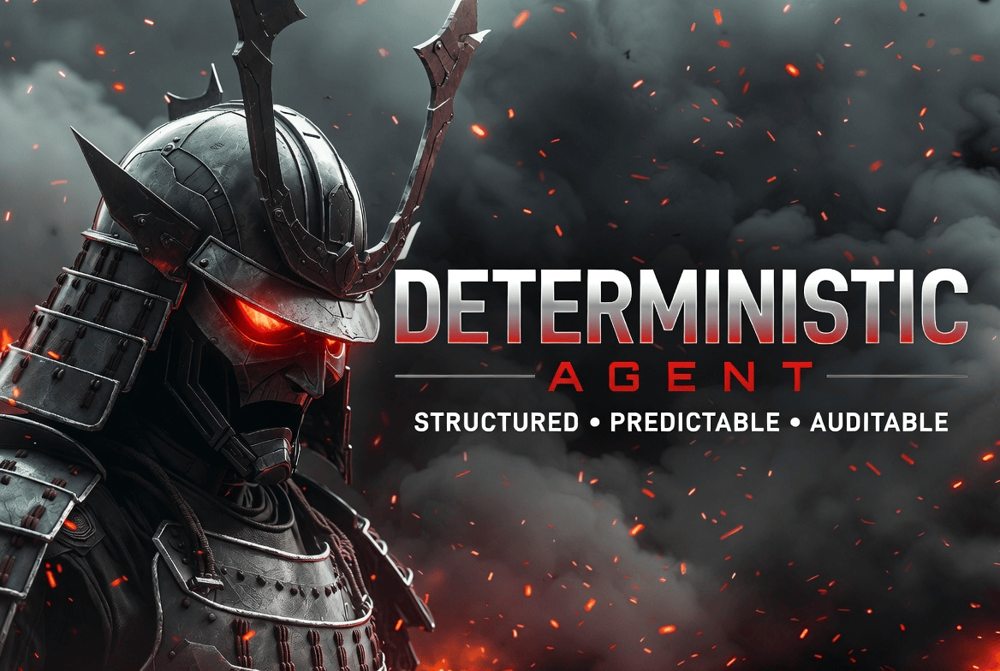
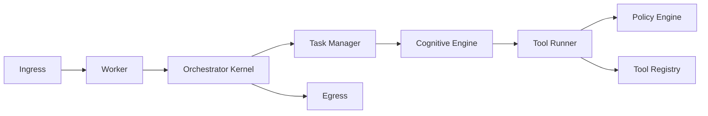

<div align="center">
  
  <h1>Heike</h1>
  <p><strong>Deterministic AI Runtime for Production-Grade Agent Systems</strong></p>
  <p>Reproducible execution · Policy-gated tools · Workspace-safe operations</p>
</div>

<p align="center">
  <a href="#quick-start"></a>
  <a href="docs/intro.md"></a>
  <a href="docs/domains/overview.md"></a>
  <a href="CONTRIBUTING.md"></a>
</p>

<p align="center">
  
  
  
  
  
</p>

<p align="center">
  
</p>

<table>
  <tr>
    <td width="33%" align="center">
      <h3>Deterministic Core</h3>
      <p><code>plan -> think -> act -> reflect</code></p>
      <p>Predictable state transitions and auditable execution traces.</p>
    </td>
    <td width="33%" align="center">
      <h3>Governed Tooling</h3>
      <p><code>policy + approval + sandbox</code></p>
      <p>Tool calls are enforced by policy, not best effort prompts.</p>
    </td>
    <td width="33%" align="center">
      <h3>Production Runtime</h3>
      <p><code>run + daemon</code></p>
      <p>Shared runtime core across local REPL and long-running services.</p>
    </td>
  </tr>
</table>

## Why Heike

| Common Runtime Risk | Heike Default |
| --- | --- |
| Non-reproducible behavior across runs | Deterministic loop with explicit phase boundaries |
| Unsafe tool execution paths | Policy gate and approval workflow in the tool runner path |
| Session/workspace race conditions | Session locking and single-writer workspace model |
| Divergent local vs service behavior | Shared runtime core for interactive and daemon modes |
| Hidden behavior in runtime paths | Config-driven runtime (`config.yaml`) with explicit defaults |

> Heike is not anti LLM-first frameworks. It treats deterministic orchestration and governance as runtime invariants.

## Architecture Snapshot



## Quick Start

1. Install and run:

```sh
curl -fsSL https://raw.githubusercontent.com/harunnryd/heike/main/install.sh | sh
heike config init
export OPENAI_API_KEY="your-key"
heike run
```

2. Build from source:

```sh
go build -o heike ./cmd/heike
./heike version
./heike run
```

3. Run as daemon:

```sh
heike daemon
curl -fsS http://127.0.0.1:8080/health
```

4. Run with Docker:

```sh
docker build -t heike:local .
docker run --rm -p 8080:8080 -e OPENAI_API_KEY="your-key" heike:local
```

Common REPL commands:

```text
/help
/approve <approval_id>
/deny <approval_id>
/clear
/exit
```

## Run Modes

| Mode | Command | Best For |
| --- | --- | --- |
| Interactive REPL | `heike run` | Local development and manual agent workflows |
| Service/Daemon | `heike daemon` | Long-running operations with health checks and scheduling |

## Tooling Highlights

| Category | Tools |
| --- | --- |
| Core execution | `exec_command`, `write_stdin`, `apply_patch` |
| Web and data | `search_query`, `open`, `click`, `find`, `weather`, `finance`, `sports`, `time`, `image_query` |
| Local interaction | `view_image`, `screenshot` |

Full contracts:

- [Built-in Tools](docs/tools/built-in-tools.md)
- [Tool Reference](docs/tools/tool-reference.md)

## Documentation Map

<table>
  <tr>
    <td width="33%" valign="top">
      <h3>Start</h3>
      <ul>
        <li><a href="docs/intro.md">Docs Intro</a></li>
        <li><a href="docs/start/getting-started.md">Get Started</a></li>
        <li><a href="docs/start/quickstart.md">Quickstart</a></li>
      </ul>
    </td>
    <td width="33%" valign="top">
      <h3>Runtime Core</h3>
      <ul>
        <li><a href="docs/core/architecture.md">Architecture</a></li>
        <li><a href="docs/core/runtime-and-cli.md">Runtime and CLI</a></li>
        <li><a href="docs/core/components.md">Components</a></li>
        <li><a href="docs/core/cognitive-contract.md">Cognitive Contract</a></li>
      </ul>
    </td>
    <td width="33%" valign="top">
      <h3>Domain Deep Dives</h3>
      <ul>
        <li><a href="docs/domains/overview.md">Domain Overview</a></li>
        <li><a href="docs/domains/event-pipeline.md">Event Pipeline Domain</a></li>
        <li><a href="docs/domains/model.md">Model Domain</a></li>
        <li><a href="docs/domains/policy-and-tool-runner.md">Policy and Tool Runner Domain</a></li>
        <li><a href="docs/domains/executor.md">Executor Domain</a></li>
        <li><a href="docs/domains/sandbox.md">Sandbox Domain</a></li>
        <li><a href="docs/domains/skill-runtime.md">Skill Runtime Domain</a></li>
      </ul>
    </td>
  </tr>
</table>

### Reference and Ops

- [Skill System](docs/tools/skill-system.md)
- [Configuration](docs/reference/configuration.md)
- [Command Reference](docs/reference/command-reference.md)
- [Governance and Approvals](docs/reference/governance-and-approvals.md)
- [Provider and Auth](docs/reference/provider-auth.md)
- [Workspace Layout](docs/reference/workspace-layout.md)
- [Testing](docs/reference/testing.md)
- [Release Checklist](docs/reference/release-checklist.md)
- [Container and Release](docs/reference/container-and-release.md)
- [Repository Readiness](docs/reference/repository-readiness.md)

## Contributing and Community

- [AGENTS.md](AGENTS.md)
- [CONTRIBUTING.md](CONTRIBUTING.md)
- [SECURITY.md](SECURITY.md)
- [CODE_OF_CONDUCT.md](CODE_OF_CONDUCT.md)
- [SUPPORT.md](SUPPORT.md)
- [CHANGELOG.md](CHANGELOG.md)

## Release Assets

- [.goreleaser.yaml](.goreleaser.yaml)
- [Dockerfile](Dockerfile)
- [Dockerfile.goreleaser](Dockerfile.goreleaser)
- [CI Workflow](.github/workflows/ci.yaml)
- [Release Workflow](.github/workflows/release.yaml)
- [LICENSE](LICENSE)
