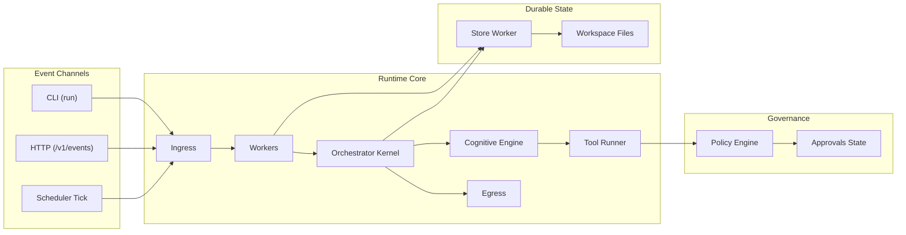
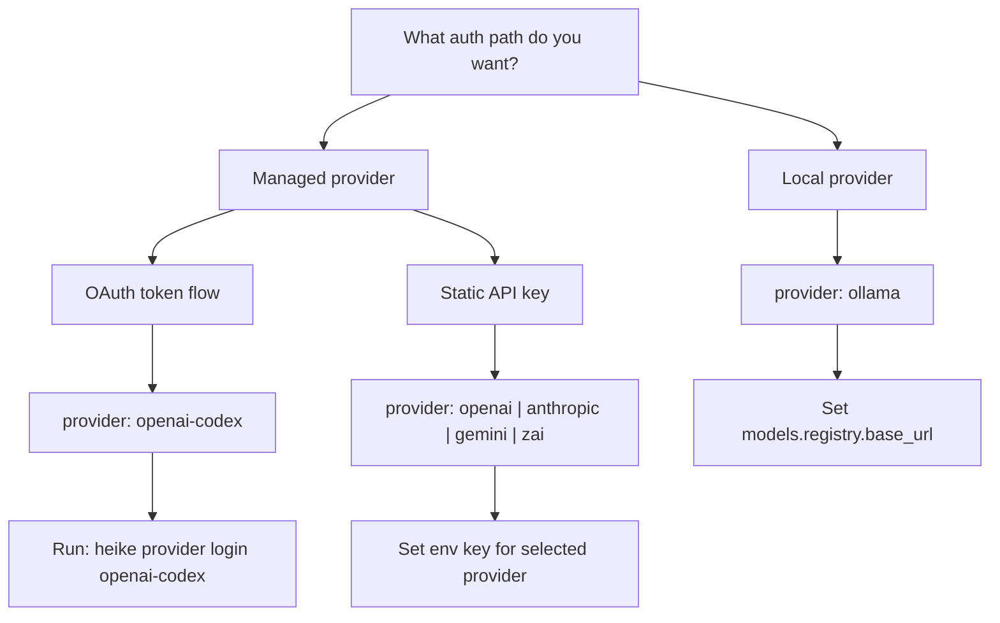
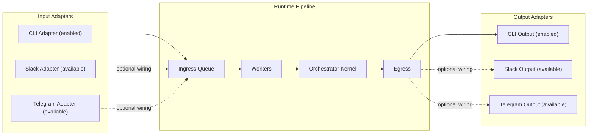
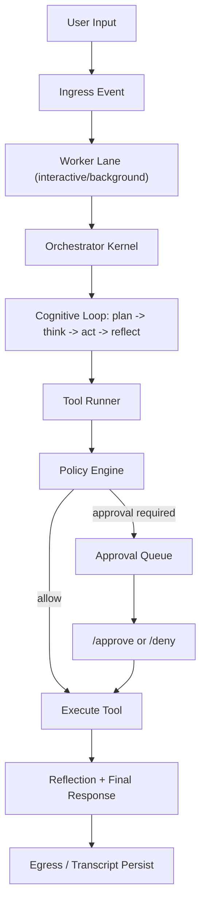
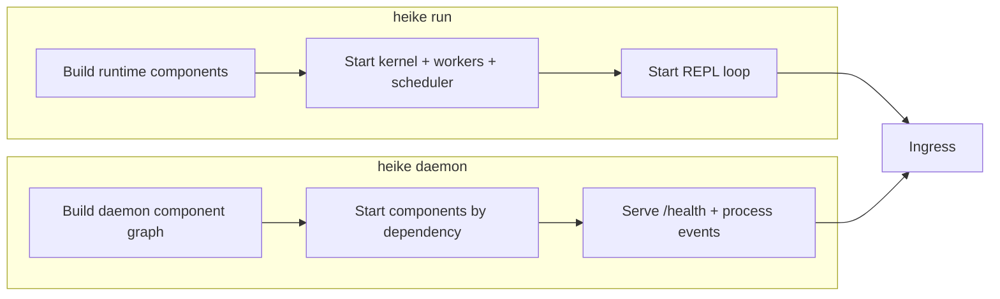

<div align="center">
  
  <h1>Heike</h1>
  <p><strong>Deterministic AI Runtime for Production-Grade Agent Systems</strong></p>
  <p>Reproducible execution · Policy-gated tools · Workspace-safe operations</p>
</div>

<p align="center">
  <a href="#quick-start"></a>
  <a href="docs/intro.md"></a>
  <a href="docs/domains/overview.md"></a>
  <a href="CONTRIBUTING.md"></a>
</p>

<p align="center">
  
  
  
  
  
</p>

<p align="center">
  
</p>

## At A Glance

- **Deterministic Core**: `plan -> think -> act -> reflect` with explicit phase boundaries.
- **Governed Tooling**: policy + approval + sandbox enforced in runtime paths.
- **Production Runtime**: shared core for `run` and `daemon` modes.

## Why Heike

- **Non-reproducible behavior across runs**: deterministic loop with explicit phase boundaries.
- **Unsafe tool execution paths**: policy gate and approval workflow in the tool runner path.
- **Session/workspace race conditions**: session locking and single-writer workspace model.
- **Divergent local vs service behavior**: shared runtime core for interactive and daemon modes.
- **Hidden runtime behavior**: config-driven execution (`config.yaml`) with explicit defaults.

> Heike is not anti LLM-first frameworks. It treats deterministic orchestration and governance as runtime invariants.

## Project Status

Heike is in **beta**. Current focus is runtime correctness, deterministic behavior, and operator safety over feature sprawl.

## System Topology



## Quick Start

Pick one path below. Do not mix commands across paths.

```sh
curl -fsSL https://raw.githubusercontent.com/harunnryd/heike/main/install.sh | sh
```

### Path A: Binary Install + OpenAI API Key

```sh
heike config init
export OPENAI_API_KEY="your-key"
heike run
```

### Path B: Binary Install + OpenAI Codex OAuth

```sh
heike config init
heike provider login openai-codex
heike run
```

### Path C: Build From Source

```sh
go build -o heike ./cmd/heike
./heike config init
OPENAI_API_KEY="your-key" ./heike run
```

### Path D: Daemon Smoke

```sh
heike daemon --workspace default
curl -fsS http://127.0.0.1:8080/health
```

### Path E: Docker Run

```sh
docker build -t heike:local .
docker run --rm -p 8080:8080 -e OPENAI_API_KEY="your-key" heike:local
```

Common REPL commands:

```text
/help
/approve <approval_id>
/deny <approval_id>
/clear
/exit
```

## Provider Setup Matrix

Heike supports multiple provider/auth paths. You are not limited to `OPENAI_API_KEY`.

- **OpenAI API**: `provider: openai` via `OPENAI_API_KEY`.
- **Anthropic API**: `provider: anthropic` via `ANTHROPIC_API_KEY`.
- **Gemini API**: `provider: gemini` via `GEMINI_API_KEY`.
- **ZAI API**: `provider: zai` via `ZAI_API_KEY`.
- **Local Ollama**: `provider: ollama` via `base_url` (optional `api_key`).
- **OpenAI Codex**: `provider: openai-codex` via OAuth token file (`heike provider login openai-codex`).



### API Key Providers

OpenAI:

```sh
export OPENAI_API_KEY="..."
heike run
```

Anthropic:

```sh
export ANTHROPIC_API_KEY="..."
heike run
```

Gemini:

```sh
export GEMINI_API_KEY="..."
heike run
```

ZAI:

```sh
export ZAI_API_KEY="..."
heike run
```

Only set keys for providers you actually use.

### OpenAI Codex OAuth (No Static API Key)

```sh
heike provider login openai-codex
heike config view
```

Relevant config keys:

- `auth.codex.callback_addr`
- `auth.codex.redirect_uri`
- `auth.codex.oauth_timeout`
- `auth.codex.token_path`

### Local Ollama Setup

```yaml
models:
  default: local-llama
  registry:
    - name: local-llama
      provider: ollama
      base_url: http://localhost:11434/v1
      api_key: ollama
```

## Adapter Setup (Slack and Telegram)

### Current Beta Runtime Status

- `heike run`: CLI ingress + CLI egress.
- `heike daemon`: component lifecycle + scheduler + health endpoint.
- Slack/Telegram adapter implementations exist in `internal/adapter`, and config schema is ready in `config.yaml`.
- Auto-wiring of Slack/Telegram adapters into daemon startup is not enabled by default yet in this beta branch.



### Slack Config Baseline

```yaml
adapters:
  slack:
    enabled: true
    port: 3000
    # signing_secret: "..."
    # bot_token: "xoxb-..."
```

Environment override equivalents:

```sh
export HEIKE_ADAPTERS_SLACK_ENABLED=true
export HEIKE_ADAPTERS_SLACK_PORT=3000
export HEIKE_ADAPTERS_SLACK_SIGNING_SECRET="..."
export HEIKE_ADAPTERS_SLACK_BOT_TOKEN="xoxb-..."
```

Slack event endpoint in adapter implementation: `POST /slack/events`.

### Telegram Config Baseline

```yaml
adapters:
  telegram:
    enabled: true
    update_timeout: 60
    # bot_token: "..."
```

Environment override equivalents:

```sh
export HEIKE_ADAPTERS_TELEGRAM_ENABLED=true
export HEIKE_ADAPTERS_TELEGRAM_UPDATE_TIMEOUT=60
export HEIKE_ADAPTERS_TELEGRAM_BOT_TOKEN="..."
```

Telegram adapter uses long polling.

## Deterministic Execution Contract

Every task executes through the same fixed cognitive loop:

1. `plan`
2. `think`
3. `act` (only when tool calls are required)
4. `reflect`

This contract is enforced by the orchestrator kernel so the runtime stays reproducible across `run` and `daemon`.

## End-to-End Request Flow



## Minimal Config Baseline

After `heike config init`, this is the minimum shape you should verify in `~/.heike/config.yaml`:

```yaml
models:
  default: gpt-5.2-codex
  registry:
    - name: gpt-5.2-codex
      provider: openai-codex

governance:
  require_approval:
    - exec_command
    - write_stdin
    - apply_patch
  auto_allow:
    - time
    - search_query
    - open
    - find

orchestrator:
  max_sub_tasks: 5
  max_tools_per_turn: 8
```

Provider credentials are read from environment variables:
`OPENAI_API_KEY`, `ANTHROPIC_API_KEY`, `GEMINI_API_KEY`, `ZAI_API_KEY`.

## Governance and Approval Workflow

Policy is enforced in the tool runner path, not only in prompting.

```sh
heike policy show
heike policy set exec_command --require-approval
heike policy set time --allow
```

When a guarded tool is requested:

1. Runtime returns an approval ID.
2. Operator resolves via `/approve <approval_id>` or `/deny <approval_id>`.
3. The exact decision is persisted in workspace governance state.

## Skill Runtime Model

Skill structure:

```text
<skill>/
  SKILL.md
  tools/
    tools.yaml
    scripts...
```

Resolution order:

1. `<workspace_path>/skills`
2. `$HOME/.heike/skills`
3. `$HOME/.heike/workspaces/<workspace-id>/skills`
4. `<workspace_path>/.heike/skills`

If `tools/tools.yaml` is absent, Heike falls back to script discovery in `tools/`.

## Persistence Model

Workspace data is stored in:
`~/.heike/workspaces/<workspace_id>/`

Important files:

- `workspace.lock`
- `sessions/index.json`
- `sessions/<session_id>.jsonl`
- `governance/approvals.json`
- `governance/domains.json`
- `governance/processed_keys.json`
- `scheduler/tasks.json`

This is what makes idempotency, approval flow, and transcript replay deterministic.

## Run Modes

- **Interactive REPL** (`heike run`): local development and manual agent workflows.
- **Service/Daemon** (`heike daemon`): long-running operations with health checks and scheduling.



## Tooling Highlights

- **Core execution**: `exec_command`, `write_stdin`, `apply_patch`.
- **Web and data**: `search_query`, `open`, `click`, `find`, `weather`, `finance`, `sports`, `time`, `image_query`.
- **Local interaction**: `view_image`, `screenshot`.

Full contracts:

- [Built-in Tools](docs/tools/built-in-tools.md)
- [Tool Reference](docs/tools/tool-reference.md)

## Quality Gates

Minimum checks before merge:

```sh
./scripts/ci/agents_guard.sh
go test ./...
go build ./cmd/heike
go vet ./...
```

## Documentation Map

### Start

- [Docs Intro](docs/intro.md)
- [Get Started](docs/start/getting-started.md)
- [Quickstart](docs/start/quickstart.md)

### Runtime Core

- [Architecture](docs/core/architecture.md)
- [Runtime and CLI](docs/core/runtime-and-cli.md)
- [Components](docs/core/components.md)
- [Cognitive Contract](docs/core/cognitive-contract.md)

### Domain Deep Dives

- [Domain Overview](docs/domains/overview.md)
- [Event Pipeline Domain](docs/domains/event-pipeline.md)
- [Model Domain](docs/domains/model.md)
- [Policy and Tool Runner Domain](docs/domains/policy-and-tool-runner.md)
- [Executor Domain](docs/domains/executor.md)
- [Sandbox Domain](docs/domains/sandbox.md)
- [Skill Runtime Domain](docs/domains/skill-runtime.md)

### Reference and Ops

- [Skill System](docs/tools/skill-system.md)
- [Configuration](docs/reference/configuration.md)
- [Command Reference](docs/reference/command-reference.md)
- [Governance and Approvals](docs/reference/governance-and-approvals.md)
- [Provider and Auth](docs/reference/provider-auth.md)
- [Workspace Layout](docs/reference/workspace-layout.md)
- [Testing](docs/reference/testing.md)
- [Release Checklist](docs/reference/release-checklist.md)
- [Container and Release](docs/reference/container-and-release.md)
- [Repository Readiness](docs/reference/repository-readiness.md)

## Contributing and Community

- [AGENTS.md](AGENTS.md)
- [CONTRIBUTING.md](CONTRIBUTING.md)
- [SECURITY.md](SECURITY.md)
- [CODE_OF_CONDUCT.md](CODE_OF_CONDUCT.md)
- [SUPPORT.md](SUPPORT.md)
- [CHANGELOG.md](CHANGELOG.md)

## Release Assets

- [.goreleaser.yaml](.goreleaser.yaml)
- [Dockerfile](Dockerfile)
- [Dockerfile.goreleaser](Dockerfile.goreleaser)
- [CI Workflow](.github/workflows/ci.yaml)
- [Release Workflow](.github/workflows/release.yaml)
- [LICENSE](LICENSE)
