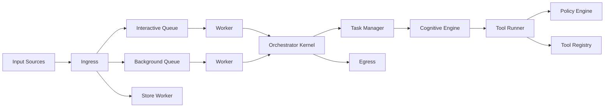

The Heike runtime is deterministic by design.

## High-Level Flow

## Request Call Chain

1. `ingress.Submit`
2. `worker.processEvent`
3. `orchestrator.Kernel.Execute`
4. `task.Manager.HandleRequest`
5. `cognitive.Engine.Run`
6. `planner -> thinker -> actor -> reflector`

## Complex Task Path

1. Heuristic gate (`ShouldDecompose`)
2. LLM decomposition (`Decompose`)
3. DAG execution (`Coordinator.ExecuteDAG`)
4. Shared cognitive engine per sub-task, each with isolated context

## Invariants

- Tool execution only via `tool.Runner`
- Policy checks before every tool execution
- Session lock per `session_id`
- Workspace single-writer lock across processes
