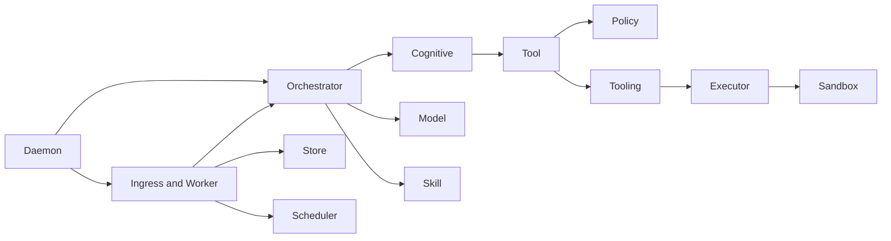

This page maps runtime modules currently present in `go list ./...`.

## Domain Cluster Diagram

## CLI Modules

- `cmd/heike`: root CLI commands (`run`, `daemon`, `config`, `policy`, `skill`, `session`, `cron`, `provider`, `version`)
- `cmd/heike/runtime`: runtime composition, workspace wiring, REPL bootstrap
- `cmd/heike/runtime/initializers`: deterministic component initialization order

## Runtime Modules (Top-Level)

- `internal/adapter`: channel adapters (CLI, Slack, Telegram, null adapter)
- `internal/auth`: provider auth flows (including OpenAI Codex OAuth)
- `internal/cognitive`: plan-think-act-reflect cognitive loop
- `internal/concurrency`: lock and goroutine utilities
- `internal/config`: YAML + env config loading/defaults
- `internal/daemon`: lifecycle manager and component graph
- `internal/egress`: outbound response abstraction
- `internal/errors`: error taxonomy and mapping helpers
- `internal/executor`: runtime executor for custom tool languages
- `internal/idempotency`: dedupe/idempotency storage
- `internal/ingress`: event normalization, routing, and queue entry
- `internal/logger`: logger setup and trace/context helpers
- `internal/model`: provider interfaces, adapters, and router
- `internal/orchestrator`: kernel for command/task handling
- `internal/policy`: approval, tool policy, and audit enforcement
- `internal/sandbox`: sandbox policy/manager abstraction
- `internal/scheduler`: cron engine and scheduler persistence
- `internal/skill`: skill loading and runtime registry integration
- `internal/store`: single-writer persistence and lock model
- `internal/tool`: tool schema, registry, validation, runner
- `internal/tooling`: unified built-in + custom tool bootstrap
- `internal/worker`: lane workers for interactive/background events

## Daemon Submodule

- `internal/daemon/components`: daemon lifecycle components (store, policy, orchestrator, ingress, workers, scheduler, HTTP server)

## Executor Submodule

- `internal/executor/runtimes`: language runtime adapters (`shell`, `python`, `javascript`, `go`, `rust`, `ruby`)

## Orchestrator Submodules

- `internal/orchestrator/command`: slash command handling (`/help`, `/approve`, `/deny`, `/clear`, `/model`)
- `internal/orchestrator/memory`: session memory manager
- `internal/orchestrator/session`: session event/history manager
- `internal/orchestrator/task`: task manager, decomposition, DAG coordinator

## Model Provider Modules

- `internal/model/contract`: provider contract models
- `internal/model/providers/openai`
- `internal/model/providers/anthropic`
- `internal/model/providers/gemini`
- `internal/model/providers/zai`
- `internal/model/providers/codex`
- `internal/model/providers/conformance_test`: cross-provider behavior conformance tests

## Skill Submodules

- `internal/skill/domain`: skill entity/value object/invariants
- `internal/skill/formatter`: `table|json|yaml` output formatters
- `internal/skill/loader`: discovery + runtime tool loader
- `internal/skill/parser`: SKILL frontmatter parser
- `internal/skill/repository`: filesystem skill repository
- `internal/skill/service`: skill application service layer
- `internal/skill/validator`: skill validation rules

## Test-Only Module

- `internal/test/integration`: integration test helpers and suites

## Built-in Tool Inventory

1. `apply_patch`
2. `click`
3. `exec_command`
4. `finance`
5. `find`
6. `image_query`
7. `open`
8. `screenshot`
9. `search_query`
10. `sports`
11. `time`
12. `view_image`
13. `weather`
14. `write_stdin`
