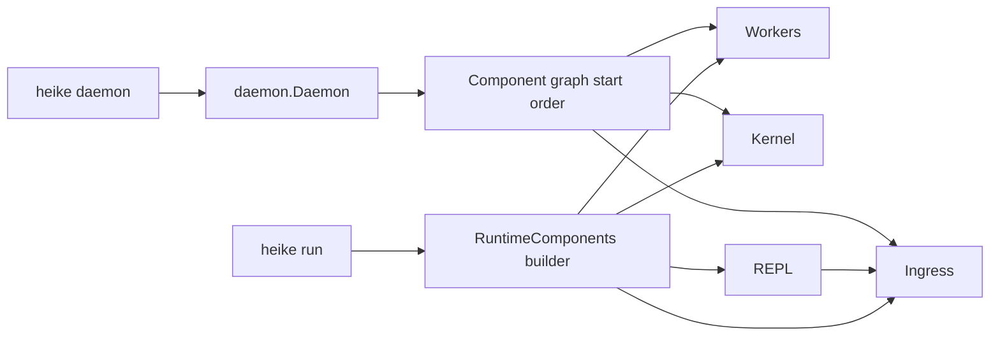

## Command Surface

- `heike run`
- `heike daemon`
- `heike config`
- `heike policy`
- `heike provider`
- `heike skill`
- `heike session`
- `heike cron`
- `heike version`

## Shared Tool Bootstrap

Both runtime modes use:

- `internal/tooling.Build(workspaceID, policyEngine, workspacePath)`

This keeps built-in/custom tool parity across `run` and `daemon`.

## Run vs Daemon Wiring

## `heike run`

1. Build runtime components (`cmd/heike/runtime/*`)
2. Start orchestrator + scheduler + workers
3. REPL submits events into ingress

## `heike daemon`

1. Build `daemon.Daemon`
2. Dependency-aware component lifecycle
3. Health endpoint exposure
4. Graceful reverse-order shutdown
