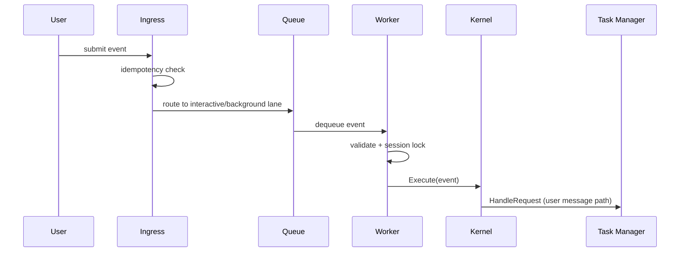

## Scope

This domain covers request ingestion, lane routing, worker execution, and kernel dispatch.

Primary modules:

- `internal/ingress`
- `internal/worker`
- `internal/orchestrator`
- `internal/concurrency` (session lock helpers)

## Sequence Diagram



## Call Chain

1. `ingress.Ingress.Submit`
2. Idempotency check (`store.CheckAndMarkKey`)
3. Routing decision (`router.Route`)
4. Workspace/session resolution (`resolver.ResolveWorkspace`, `resolver.ResolveSession`)
5. Queue placement (`interactiveQueue` or `backgroundQueue`)
6. `worker.Worker.eventLoop` reads queued event
7. `worker.Worker.processEvent` validates event and acquires session lock
8. User event persistence (`store.WriteTranscript`)
9. `orchestrator.DefaultKernel.Execute`
10. Kernel dispatch:
- slash command path: `command.Handler.Execute`
- task path: `task.Manager.HandleRequest`

## Example Flow: User Message

Input:

```text
Analyze internal/tool/tool.go
```

Behavior:

1. Ingress marks idempotency key.
2. Event goes to interactive queue.
3. Worker locks session and appends transcript entry.
4. Kernel classifies input as normal user message.
5. Task manager starts cognitive loop.

## Example Flow: Slash Command

Input:

```text
/approve 01K...
```

Behavior:

1. Ingress routes command event.
2. Worker forwards to kernel.
3. Kernel detects command and executes command handler.
4. Policy approval state is updated.

## Operational Knobs

- `ingress.interactive_queue_size`
- `ingress.background_queue_size`
- `ingress.interactive_submit_timeout`
- `ingress.drain_timeout`
- `worker.shutdown_timeout`

## Common Failure Modes

- Duplicate event key: returns `ErrDuplicateEvent`.
- Interactive queue pressure: transient drop on submit timeout.
- Missing session/workspace resolution: wrapped ingress error.
- Long-running orchestration blocking lane throughput.
