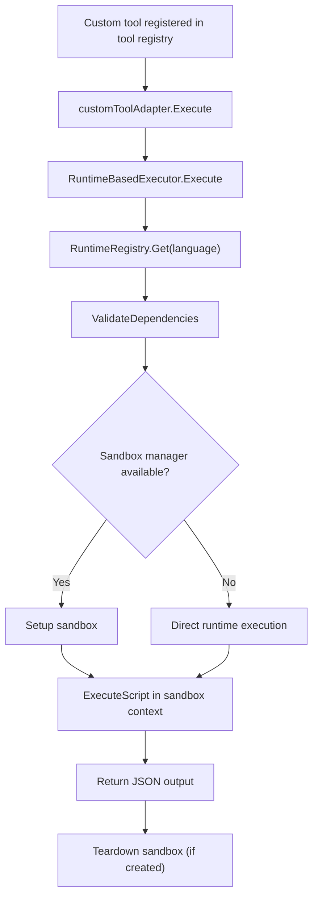

## Scope

This domain executes custom runtime tools (scripts/binaries) across language runtimes.

Primary modules:

- `internal/executor/executor.go`
- `internal/executor/runtimes/*`
- `internal/tooling/builder.go` (wiring custom tools)

## Runtime Tool Execution Diagram

## Call Chain

1. Tool bootstrap: `tooling.Build` calls `registerCustomTools`.
2. `registerCustomTools` creates runtime registry (`runtimes.NewRuntimeRegistry`).
3. It wires `RuntimeBasedExecutor` and validates each custom tool.
4. Each custom tool is wrapped by `customToolAdapter` and registered in tool registry.
5. At runtime, adapter calls `RuntimeBasedExecutor.Execute`.
6. Executor resolves language runtime (`runtimes.Get`).
7. Executor validates dependencies (`ValidateDependencies`).
8. Runtime executes script via `ExecuteScript`.

## Supported Runtime Types

- `shell`
- `python`
- `javascript`
- `go`
- `ruby`
- `rust`

## Example Flow: Python Skill Tool

1. Skill tool is discovered from skill path.
2. Runtime registry confirms Python runtime availability.
3. Executor validates Python dependencies.
4. Script runs with JSON input and returns JSON output.

## Common Failure Modes

- Runtime binary missing (for example `python3` not installed).
- Dependency validation failure.
- Script path not accessible.
- Runtime output is not valid JSON for tool contract.
