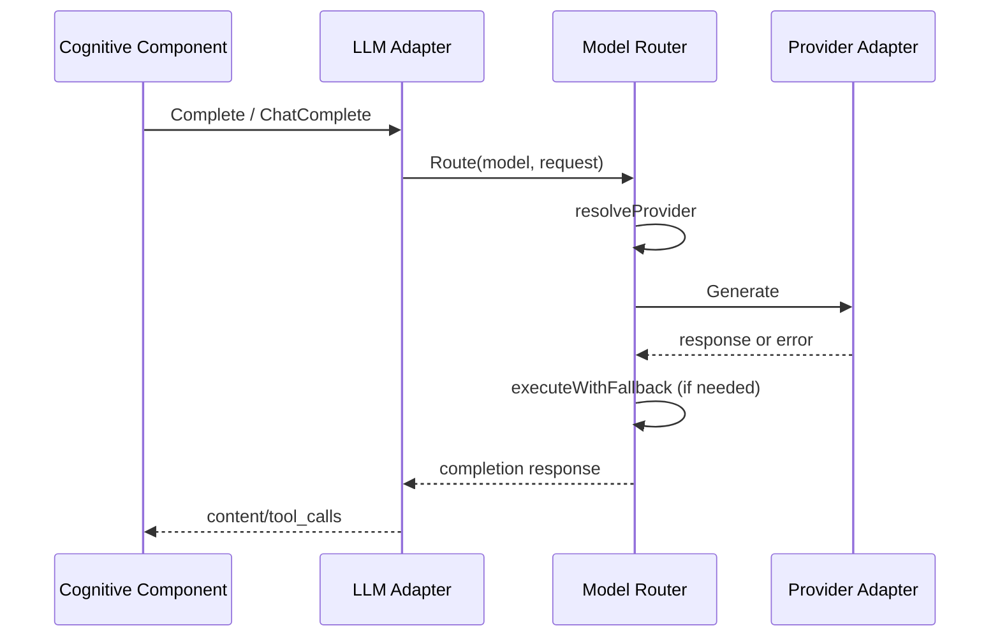
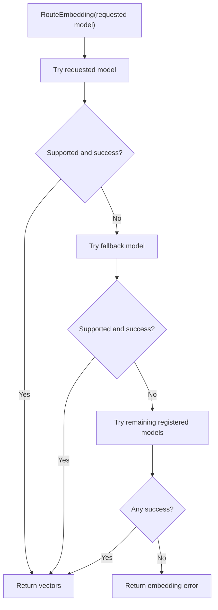

## Scope

This domain owns model routing, provider adaptation, fallback handling, and embedding calls.

Primary modules:

- `internal/model/router.go`
- `internal/model/provider_adapter.go`
- `internal/model/providers/*`
- `internal/model/contract`

## Completion Routing Diagram

## Embedding Routing Diagram

## Call Chain

Completion path:

1. `orchestrator.NewKernel` creates router via `model.NewModelRouter`.
2. Kernel wires `LLMExecutorAdapter`.
3. Cognitive components (`planner`, `thinker`, `reflector`) call adapter.
4. Adapter calls `router.Route`.
5. Router resolves provider (`resolveProvider`) and executes with fallback (`executeWithFallback`).
6. `ProviderAdapter.Generate` dispatches to provider implementation.

Embedding path:

1. Kernel wires memory manager (`memory.NewManager`) with router.
2. Memory retrieval/storage calls `router.RouteEmbedding`.
3. Router tries requested model, fallback model, and registered providers in order.

## Example Flow: Completion With Fallback

If request model is unavailable or fails:

1. Router attempts requested model.
2. If configured and eligible, router switches to `models.fallback`.
3. Request is retried up to `models.max_fallback_attempts`.

## Example Flow: Embedding

1. Memory manager sends text to `RouteEmbedding`.
2. Router tries models in embedding order.
3. First provider that supports embeddings and succeeds returns vectors.

## Configuration Surface

- `models.default`
- `models.fallback`
- `models.embedding`
- `models.max_fallback_attempts`
- `models.registry[]`

## Common Failure Modes

- Model name not registered in `models.registry`.
- Provider API key missing.
- Fallback model not present.
- Provider timeout or network failure.
