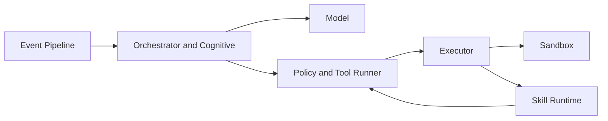

This section explains Heike runtime domains beyond package inventory. Each page includes:

- Scope and ownership boundaries
- Real call-chain wiring from current code
- Operational examples and failure modes

## Domain Pages

- [Event Pipeline Domain](event-pipeline.md)
- [Model Domain](model.md)
- [Policy and Tool Runner Domain](policy-and-tool-runner.md)
- [Executor Domain](executor.md)
- [Sandbox Domain](sandbox.md)
- [Skill Runtime Domain](skill-runtime.md)

## Domain Interaction Map

## Shared Runtime Path

Most interactive requests follow this path:

1. `ingress.Ingress.Submit`
2. `worker.Worker.processEvent`
3. `orchestrator.DefaultKernel.Execute`
4. `task.Manager.HandleRequest`
5. `cognitive.Engine.Run`
6. `tool.Runner.Execute` (when tools are called)

For command inputs (for example `/approve`), the kernel routes to command handler instead of task execution.
