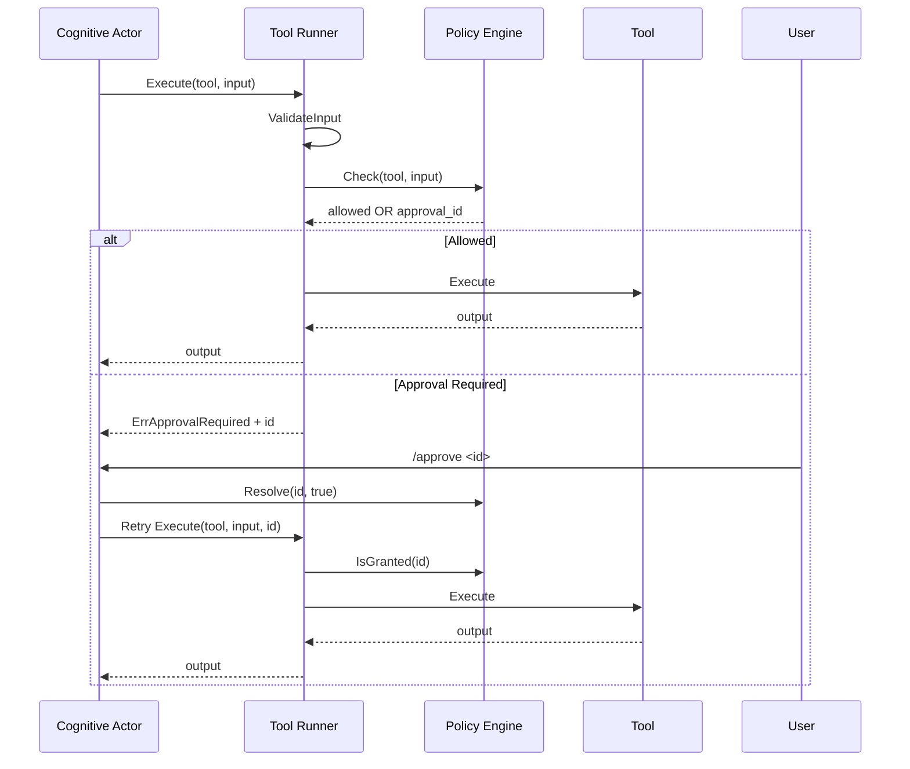

## Scope

This domain enforces tool safety, approval workflow, and runtime execution boundaries.

Primary modules:

- `internal/tool/runner.go`
- `internal/tool/validator.go`
- `internal/policy/engine.go`
- `internal/orchestrator/command/handler.go` (approval resolution)

## Tool Execution With Approval Diagram

## Call Chain

1. Cognitive actor requests a tool call.
2. `orchestrator.ActorAdapter.Execute` calls `tool.Runner.Execute`.
3. Runner resolves tool from registry (`registry.Get`).
4. Runner validates input against tool schema (`ValidateInput`).
5. Runner invokes policy engine:
   - new call: `policy.Engine.Check`
   - retry call: `policy.Engine.IsGranted` with approval ID
6. If allowed, tool executes via `tool.Tool.Execute`.
7. If approval is required, runner returns approval-required error with approval ID.
8. User resolves via slash command:
- `/approve <id>` -> `policy.Engine.Resolve(id, true)`
- `/deny <id>` -> `policy.Engine.Resolve(id, false)`

## Example Flow: Approval Required

1. User asks for `exec_command`.
2. Policy requires approval and returns pending approval ID.
3. Agent prompts approval ID in session.
4. User runs `/approve <id>`.
5. Retry execution proceeds with granted approval.

## Policy Inputs Considered

- Tool name (`governance.auto_allow`, `governance.require_approval`)
- Domain allowlist rules for URL-carrying inputs
- `sandbox_permissions` request mode
- Daily per-tool limit (`governance.daily_tool_limit`)

## Common Failure Modes

- Invalid tool input JSON shape.
- Missing approval or denied approval.
- Tool not found in registry.
- Quota exceeded for a tool.
