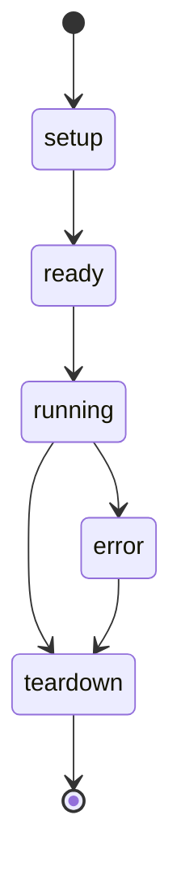
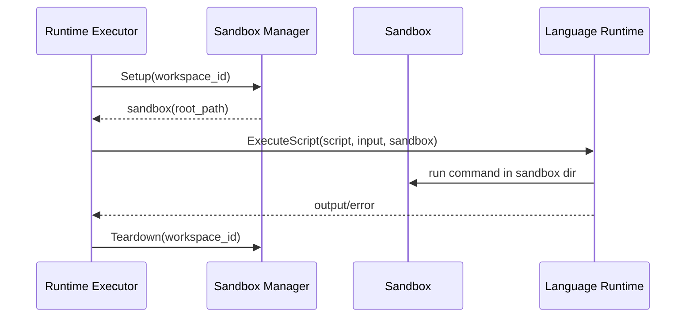

## Scope

This domain provides isolated execution context for runtime-based custom tools.

Primary modules:

- `internal/sandbox/sandbox.go`
- `internal/sandbox/basic.go`
- `internal/sandbox/manager.go`
- `internal/executor/executor.go` (sandbox integration point)

## Sandbox Lifecycle Diagram

## Execution Sequence Diagram

## Call Chain

1. Tool bootstrap creates `BasicSandboxManager`.
2. Runtime executor receives sandbox manager through `SetSandbox`.
3. During custom tool execution:
- `SandboxManager.Setup(workspaceID)`
- Runtime executes script in sandbox root
- Deferred `SandboxManager.Teardown(workspaceID)`

## Basic Sandbox Behavior

- Sandbox directories are created under base sandbox path.
- Each setup creates unique sandbox ID and root directory.
- Command execution can run with traversal checks enabled.
- Teardown removes workspace sandbox directories after execution.

## Example Flow: Sandbox-Protected Script Execution

1. Runtime executor resolves current workspace ID.
2. Sandbox setup returns root path for the run.
3. Script runs inside sandbox path.
4. Teardown cleans sandbox files after run.

## Safety Notes

- Basic traversal checks reject suspicious path arguments (`..`, absolute paths, `~`).
- Sandbox policy level and resource limits are attached to sandbox state.
- Governance policy can also require approval via `sandbox_permissions`.

## Common Failure Modes

- Sandbox base directory cannot be created.
- Setup/teardown filesystem permissions fail.
- Command execution fails inside sandbox runtime environment.
