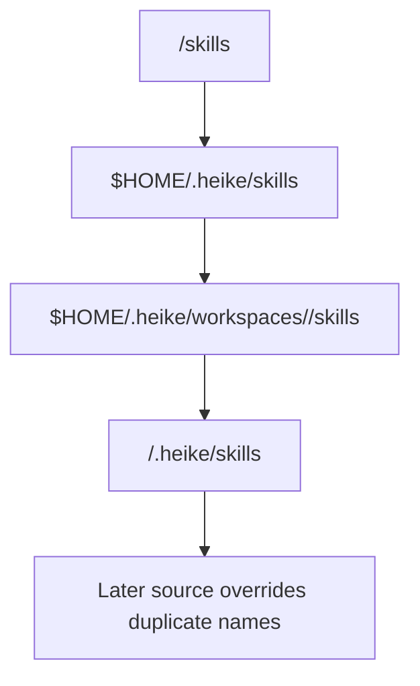
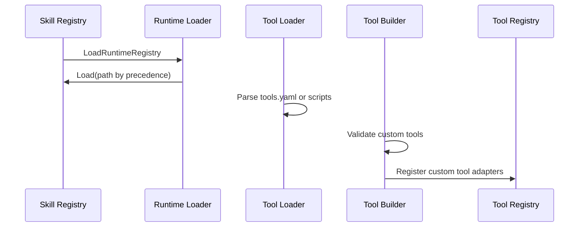

## Scope

This domain covers runtime skill discovery, precedence, and custom-tool registration.

Primary modules:

- `internal/skill/runtime_loader.go`
- `internal/skill/registry.go`
- `internal/skill/loader/*`
- `internal/tooling/builder.go` (custom tool registration path)

## Skill Resolution Precedence Diagram

## Runtime Registration Diagram

## Runtime Skill Path Precedence

Load order is deterministic and later loads override duplicate names:

1. `<workspace_path>/skills` (bundled project skills)
2. `$HOME/.heike/skills` (global skills)
3. `$HOME/.heike/workspaces/<workspace-id>/skills` (workspace scoped)
4. `<workspace_path>/.heike/skills` (project-local external installs)

## Call Chain

1. Runtime initializes skill registry.
2. `skill.LoadRuntimeRegistry` loads skill directories by precedence.
3. Tool loader parses skill tool definitions (`tools/tools.yaml` or script discovery).
4. `tooling.Build` validates and registers custom tools into tool registry.
5. Cognitive loop sees selected tools through bounded `AvailableTools`.

## Example Flow: Bundled + Workspace Override

1. A skill exists in bundled `skills/<name>`.
2. Another skill with same name exists in workspace-scoped path.
3. Later load wins, so workspace version overrides bundled behavior.

## Operational Notes

- Bundled skills in `./skills` are auto-loaded and do not require install command.
- `heike skill install <path>` is for external skills into `./.heike/skills`.
- Validation command: `heike skill test <name>`.

## Common Failure Modes

- Invalid `SKILL.md` frontmatter.
- Missing runtime dependency for custom tool language.
- Duplicate skill names causing unexpected override behavior.
